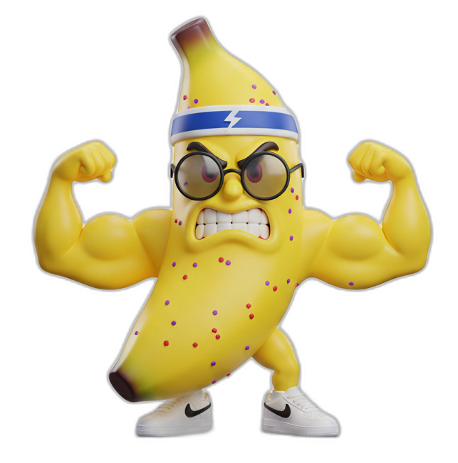

<p align="center">
  
</p>

<h1 align="center">megabananas</h1>

<p align="center">
  IDE-style application for generating and managing AI character images and animations using Gemini image models.
</p>

<p align="center">
  
</p>

## Features

- **Project-based organization** — All work contained in discrete projects with hierarchical navigation
- **AI character generation** — Create characters from text prompts with configurable style presets
- **Asset provenance tracking** — Every generated image tracked with prompts, references, and settings
- **Character variations** — Generate multiple versions of a character with full lineage
- **Frame-by-frame animations** — Sequential frame generation with smart reference modes
- **Sprite sheet generation** — Generate complete animation sprite sheets from character references
- **Image processing** — Background removal and sprite sheet slicing via ImageMagick
- **Project-level references** — Shared reference images across all generation forms
- **IDE three-column layout** — Left nav, tabbed workspace, context-aware action panel

## Tech Stack

- Next.js 16 (App Router)
- React 19
- TypeScript
- Tailwind CSS v4
- Prisma ORM + PostgreSQL
- Zustand (state management)
- shadcn/ui components
- @google/genai (Gemini 3 Pro)
- magickwand.js (ImageMagick bindings)

## Data Model

```
Project
  ├── Character
  │     ├── primaryAsset (Asset)
  │     ├── variations (Asset[])
  │     ├── Animation → Frame → Asset
  │     └── SpriteSheet → Asset
  └── Asset (unified storage with provenance)
        └── types: reference | character | frame | spritesheet
```

**Asset provenance fields**: `systemPrompt`, `userPrompt`, `referenceAssetIds`, `generationSettings`

## Setup

1. Install dependencies:
```bash
bun install
```

2. Configure environment:
```bash
cp .env.example .env
# Add your credentials:
# GEMINI_API_KEY=your_key
# DATABASE_URL=postgresql://...
```

3. Initialize database:
```bash
bun run db:generate
bun run db:push
```

4. Start dev server:
```bash
bun dev
```

## Project Structure

```
app/
  api/
    projects/            CRUD for projects
      [id]/references/   Project-level reference assets
    characters/          CRUD for characters
    animations/          CRUD for animations
      [id]/reorder/      Reorder animation frames
    frames/              Frame management
    assets/              Asset storage
    spritesheets/        CRUD for sprite sheets
    gen-character/       Generate character image
    gen-animation/       Generate animation frames (smart ref modes)
    gen-spritesheet/     Generate sprite sheet grid
    gen-sprite/          Legacy sprite generation
    edit-character/      Edit existing character

components/
  ide/
    app-layout.tsx       Three-column IDE shell
    left-sidebar.tsx     Project/character/animation nav
    right-sidebar.tsx    Context-aware action forms
    workspace.tsx        Tabbed content area
    views/
      project-view.tsx   Project overview
      character-view.tsx Character detail w/ animations & spritesheets
      animation-view.tsx Frame sequence (sortable)
      spritesheet-view.tsx Sprite sheet viewer
      asset-view.tsx     Asset detail w/ metadata
    forms/
      new-character-form.tsx
      new-animation-form.tsx
      new-spritesheet-form.tsx
      new-frame-form.tsx
      edit-character-form.tsx
      generate-variation-form.tsx
      asset-metadata-panel.tsx

lib/
  prisma.ts              Database client
  store.ts               Zustand global state
  gemini.ts              Gemini API helpers
  image-utils.ts         ImageMagick utils (bg removal, sprite slicing)
  config/
    character-presets.ts Style/angle/background options
    animation-prompts.ts Frame prompt builder (ref mode logic)

prisma/
  schema.prisma          Data model definitions
```

## Character Generation Presets

| Category | Options |
|----------|---------|
| Style | Pixel Art, Anime, Cartoon, Realistic, Chibi, Flat Design |
| Angle | Front, 3/4 View, Side Profile, Back, Dynamic Pose |
| Background | White, Black, Gray, Green Screen |

## Animation Frame Generation

Sequential frame generation uses smart reference modes:

| Frame | Reference Mode | Images Provided |
|-------|----------------|-----------------|
| 0 | `character` | Character reference only |
| 1-3 | `previous` | Previous frame only |
| 4+ | `dual` | Character + previous frame |

This progressive approach maintains character consistency while allowing natural motion progression.

## Image Processing

`lib/image-utils.ts` provides ImageMagick-powered utilities:

- **`removeBackground(buffer, options)`** — Floodfill-based background removal
- **`splitSpritesheet(buffer, {cols, rows})`** — Split sprite sheet into individual frames
- **`getImageDimensions(buffer)`** — Get image width/height

## Scripts

| Command | Description |
|---------|-------------|
| `bun dev` | Start development server |
| `bun run build` | Production build |
| `bun run db:migrate` | Run Prisma migrations |
| `bun run db:push` | Push schema to database |
| `bun run db:studio` | Open Prisma Studio |
| `bun run lint` | Lint with Biome |
| `bun run typecheck` | TypeScript check |

## Generation Endpoints

| Endpoint | Description |
|----------|-------------|
| `POST /api/gen-character` | Generate character from text prompt |
| `POST /api/gen-animation` | Generate sequential animation frames |
| `POST /api/gen-spritesheet` | Generate sprite sheet grid |
| `POST /api/edit-character` | Edit existing character with prompt |
